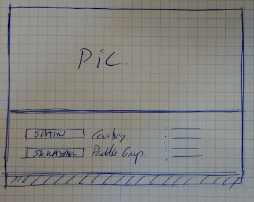
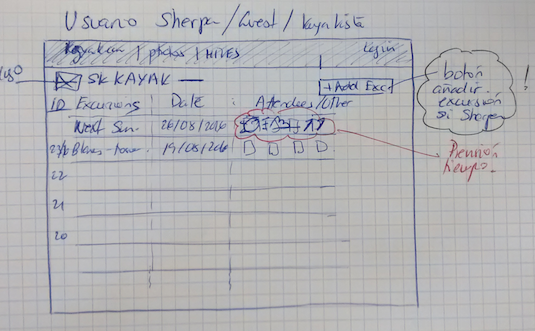
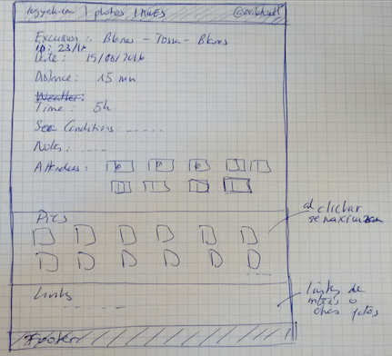
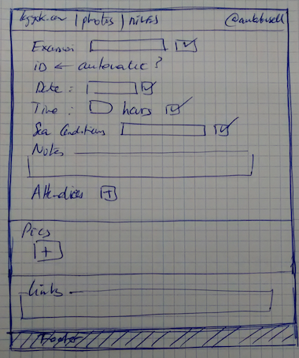
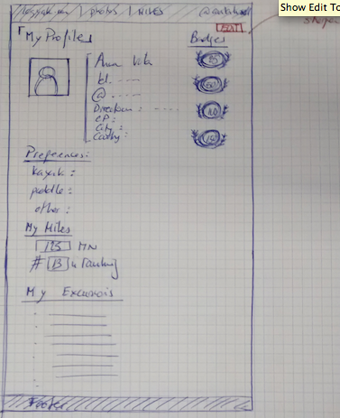
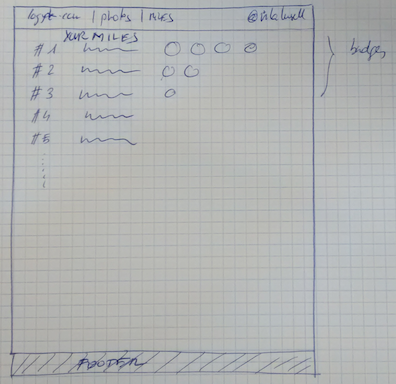
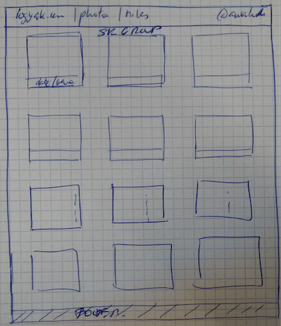

# Página Inicio

La página de inicio está formada por 2 secciones: una superior con fotos de diferentes situaciones en kayak y una inferior con:

 * formulario para rellenar el país
 * formulario para buscar un nombre de grupo

Al buscar palabras similares el formulario dará como resultado una lista de grupos de kayak del país seleccionado. Al clikar a un grupo irás a la página de inicio de excursiones del grupo. Esto lo puedes hacer sin logarte, es decir, como invitado. 

 

# Página excursiones del grupo

Al ir a la página del grupo en cuestión,

+ aparecerá en el header:
 * nobmre del grupo
 * apartado Fotos
 * apartado Millas
 * login

+ título de la página: "Excursiones + Nobre del grupo"

+ Como participante del grupo puedo actuar de 3 formas diferentes, es decir, habrá 3 tipos de usuarios:
 * invitado
 * kayakista
 * sherpa

+ un listado de las excursiones invertido cronológicamente, ya sea excrusiones realizadas como las pendientes de realizar. Los campos que aparecerán son:
 * nombre excursión
 * fecha excursión
 * quién atendió

+ En caso de que no se haya realizado la excursión, puede aparecer el listado de la gente prevista que ha ido confirmando y la previsión del tiempo. 

+ El usuario Sherpa tendrá un botón para:
 * editar nueva excursión
 * cancelar excursión prevista

 

# Página detalle de una excursión

Un usuario "kayakista", al clikar sobre una excursión de la página "excursiones del grupo", puede leer el detalle de la excursión.

Al ir a la página del detalle de la excursión,

+ aparecerá en el header:
 * nobmre del grupo
 * apartado fotos
 * apartado Millas
 * @usuario

+ título de la página: "Nombre de la excursión"

+ un listado con los campos:
 * id
 * nombre excursión
 * fecha excursión
 * tiempo empleado
 * distancia en millas náuticas
 * condiciones del mar
 * notas (campo de texto para añadir notas)
 * quién atendió
 * fotos
 * links (para que otros participantes puedan mandar links de dropbox, etc con sus fotos)
 * ruta (en un futuro poder colgar la ruta GPS y subirla en googlemaps)

El usuario "Sherpa" tendrá un botón para:

 * editar la excursión

 
 

# Página detalle del perfil

Un usuario "kayakista", al clikar sobre un usuario de la página "excursiones del grupo", puede leer el detalle del perfil.

Al ir a la página del detalle del perfil,

+ aparecerá en el header:
 * nobmre del grupo
 * apartado fotos
 * apartado Millas
 * @usuario

+ título de la página: "Nombre del Perfil"

+ un listado con los campos:
 * nombre kayakista
 * teléfono
 * email 
 * dirección de contacto
 * CP
 * país

+ un listado de los badges que ha conseguido según millas realizadas

+ un apartado de "Preferencias" con los campos:
 * kayak
 * pala
 * otros (campo texto libre)
 
+ un apartado "Mis Millas" con los campos:
 * (millas) mn
 * nº (posición) en el ránking del grupo

+ un apartado "Mis excursiones" con una lista de las excursiones que he realizado. La lista contendrá:
 * id
 * nombre de la excursión
 * fecha 
 * millas

El usuario "kaykaista" en cuestión y el usuario "Sherpa" tendrán un botón para editar el prefil.

 

# Página Millas

Un usuario "kayakista" y "Sherpa", al clikar sobre el menú "millas" puede acceder al ranking de millas de los participantes del grupo. El usuario Guest no puede acceder aquí.

Al ir a la página de Millas, 

+ aparecerá en el header:
 * nombre del grupo
 * apartado fotos
 * apartado Millas
 * @usuario

+ título de la página: "ranking Millas + nombre del grupo"

+ aparecerá una lista ordenada de los kayakistas, de más a menos millas. La lista contendrá los siguientes campos o columnas:
 * posición
 * nombre del kayakista
 * millas
 * badges que ha ganado

+ si un usuario está dado de alta como kayakista pero no tiene millas porque es un espectador, no aparecerá en el listado. Solo aparecen los que tengan millas en su perfil para evitar listas inconpletas o infinitas.

 

# Página Fotos

Un usuario "kayakista" y "Sherpa", al clikar sobre el menú "fotos" puede acceder a todas las fotos que se han realizado en las diferentes excursiones. El usuario Guest no puede acceder aquí.

Al ir a la página de Fotos, 

+ aparecerá en el header:
 * nombre del grupo
 * apartado fotos
 * apartado Millas
 * @usuario

+ título de la página: "fotos + nombre del grupo"

+ aparecerá una lista ordenada de los grupos de fotos según:
 * id
 * nombre de la excursión
 * fecha

 

# Página Expeditions

(extensión del proyecto...)
Se trataría de realizar una listado de las expediciones y una página de detalle por cada expedición. Cada expedición tiene varias excursiones. De momento lo trataremos como una excursión más, introduciendo como fecha la fecha de salida y las millas como el total de las millas realizadas.

